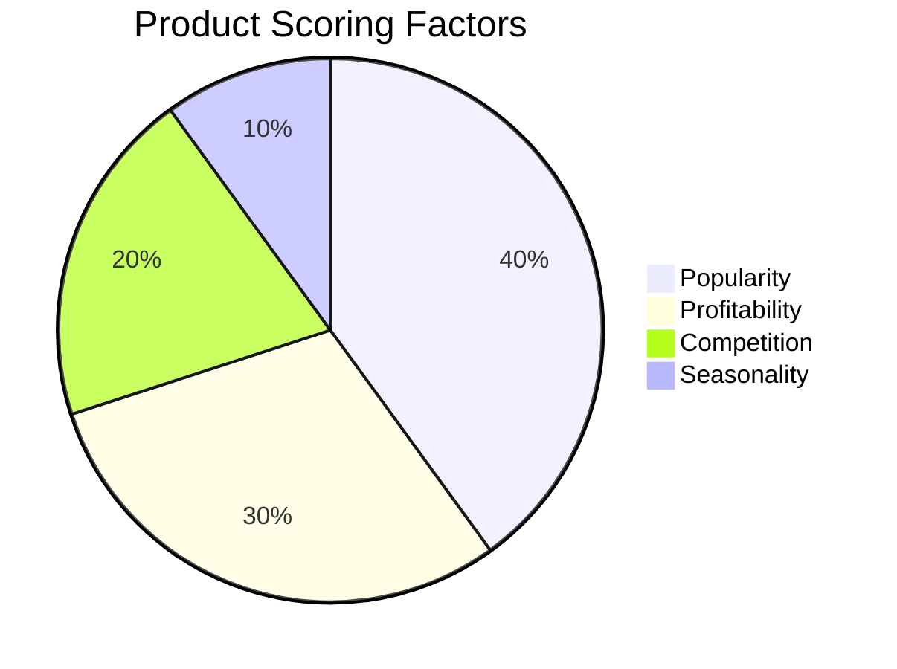
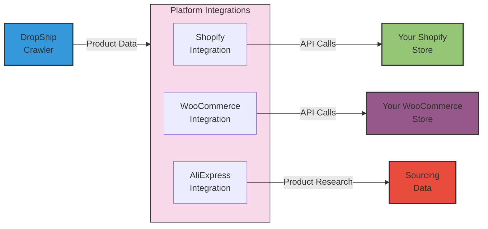

# DropShip Trend Crawler

[](https://opensource.org/licenses/MIT)
[](https://nodejs.org/)
[](https://www.mongodb.com/)
[](#e-commerce-integrations)

An automated system that uses the Brave Search API to identify trending products for dropshipping.

<p align="center">
  <a href="https://www.buymeacoffee.com/nabz0r"></a>
</p>

## How it works

Unlike a traditional web crawler, this system uses the Brave Search API to discover potential products by performing targeted searches. The process takes place in three main steps:

```mermaid
flowchart LR
    A["Discovery\nBrave Search API"] --> B["Analysis\nScoring Algorithm"]
    B --> C["Decision\nIndex / Watch / Skip"]
    C --> D["Integration\nE-commerce Platform"]
    style A fill:#3498db,stroke:#333,stroke-width:2px
    style B fill:#2ecc71,stroke:#333,stroke-width:2px
    style C fill:#e74c3c,stroke:#333,stroke-width:2px
    style D fill:#9b59b6,stroke:#333,stroke-width:2px

1. **Discovery**: Predefined queries are sent to the Brave Search API to find potential products
2. **Analysis**: Each product is evaluated according to popularity, profitability, competition and seasonality
3. **Decision**: Based on this analysis, the system recommends adding, monitoring or ignoring each product

[Learn more about how it works in detail](docs/fonctionnement.md)

## System Architecture

```mermaid
flowchart TD
    API["Brave Search API"] --> Crawler
    AliExpress["AliExpress API"] --> ProductSource
    
    subgraph Core["Core System"]
        Crawler --> DB[(MongoDB)]
        ProductSource["Product Source"] --> DB
        DB --> Analyzer
        Analyzer --> DB
        DB --> CatalogManager["Catalog Manager"]
    end
    
    subgraph Integrations["E-commerce Integrations"]
        CatalogManager --> Shopify["Shopify Store"]
        CatalogManager --> WooCommerce["WooCommerce Store"]
        CatalogManager --> OtherPlatforms["Other Platforms"]
    end
    
    DB --> WebUI["Web Dashboard"]
    User[User] --> WebUI
    WebUI --> IntegrationsUI["Integrations UI"]
    IntegrationsUI --> Integrations
    
    classDef external fill:#f9f9f9,stroke:#333,stroke-width:1px
    classDef core fill:#d6eaf8,stroke:#333,stroke-width:2px
    classDef ui fill:#e8f8f5,stroke:#333,stroke-width:2px
    classDef integrations fill:#f8d9e9,stroke:#333,stroke-width:2px
    
    class API,AliExpress external
    class Core core
    class WebUI,User,IntegrationsUI ui
    class Integrations,Shopify,WooCommerce,OtherPlatforms integrations

```

## Objective

This project aims to develop a web application that:

1. Automatically crawls the web at regular intervals (every hour)
2. Identifies trending products on various platforms
3. Analyzes their potential for dropshipping
4. Generates recommendations for adding or removing products
5. Automates the indexing/deindexing of products in your catalog

## Technologies

<p align="center">
  
  
  
  
  
  
</p>

- **Backend**: Node.js with Express
- **Frontend**: HTML, CSS, JavaScript
- **Database**: MongoDB
- **Crawling**: Brave Search API
- **Integrations**: Shopify, WooCommerce, AliExpress
- **Deployment**: Docker and GitHub Actions

## Prerequisites

- Node.js 14+ and npm installed
- MongoDB installed and running (optional - the system can run in demo mode without a database)
- Brave Search API key (optional - the system uses test data if no key is configured)
- For e-commerce integrations: API credentials for your platform (Shopify, WooCommerce, etc.)


[MongoDB Installation Guide](docs/mongodb-installation.md)

## Installation

```bash
# Clone the repository
git clone https://github.com/nabz0r/dropship-trend-crawler.git
cd dropship-trend-crawler

# Install dependencies
npm install

# Configuration
cp .env.example .env
# Edit the .env file with your API keys and other settings
```

## Run

### Development mode (with automatic reloading)

```bash
npm run dev
```

### Production mode

```bash
npm start
```

The application will be available at `http://localhost:3000` (or the port specified in your .env file).

## Key Features

### Demo Mode

The system can run without MongoDB and Brave Search API keys using mock data. This is great for quickly testing features without a full setup.

### Custom configuration

You can customize the system behavior via the `config/crawler-settings.json` file or via the web interface:
- Modify search queries
- Adjust the weights of the different analysis factors
- Configure decision thresholds
- Enable/disable automatic indexing

### Product Analysis



### E-commerce Integrations

The system now includes built-in integrations with popular e-commerce platforms:


Configure your platform credentials in the dedicated Integrations page and enable automatic product publishing

## API Endpoints

The REST API exposes the following endpoints:

| Endpoint | Method | Description |
|----------|--------|-------------|
| `/api/products` | GET | List of discovered products |
| `/api/products/:id` | GET | Details of a specific product |
| `/api/products` | POST | Add a product manually |
| `/api/products/:id` | PUT | Update a product |
| `/api/products/:id` | DELETE | Delete a product |
| `/api/trends` | GET | Current product trends |
| `/api/trends/history` | GET | Trend history |
| `/api/trends/categories` | GET | Trends by category |
| `/api/trends/search-terms` | GET | Top search terms |
| `/api/settings` | GET | Current system settings |
| `/api/settings` | PUT | Update settings |
| `/api/settings/reset` | GET | Reset to default |
| `/api/crawl` | POST | Manually trigger a crawl |
| `/api/integrations/test` | GET | Test the e-commerce integration connection |
| `/api/integrations/status | GET | Get integration status |
| `/api/integrations/search-aliexpress | POST | Search for products on AliExpress |

## Integrating with your dropshipping system

To integrate this system with your dropshipping platform, you can:

1. Use the built-in integrations for Shopify and WooCommerce
2. Modify the addProductToCatalog and removeProductFromCatalog methods in src/services/catalogManager.js to connect to other platforms
3. Develop specific middlewares to translate data between our format and your platform's.
4. Use the REST API to develop your own user interface.

## Screenshots


## Future development

See the task list in the [TASKS.md](TASKS.md) file for features planned for future releases. 


## Documentation

See the `docs/` folder for detailed information on:

- [How the system works](docs/fonctionnement.md)
- [Using the Brave Search API](docs/brave_api.md)
- [System architecture](docs/architecture.md)
- [Installing MongoDB](docs/mongodb-installation.md)

## 🤝 Contribution

We welcome:

- 💻 Network Engineers
- 👀 Research Scientists
- 🌎 Cloud Architects
- 🤖 AI/ML Specialists

## 📱 Contact

- 📧 Email: nabz0r@gmail.com
- 🐙 GitHub: [@nabz0r](https://github.com/nabz0r)

## 📄 License

[MIT License](LICENSE) - Innovation without Boundaries
