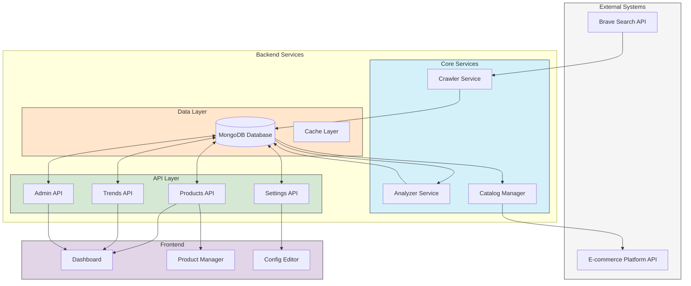
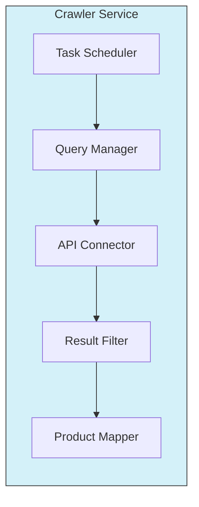
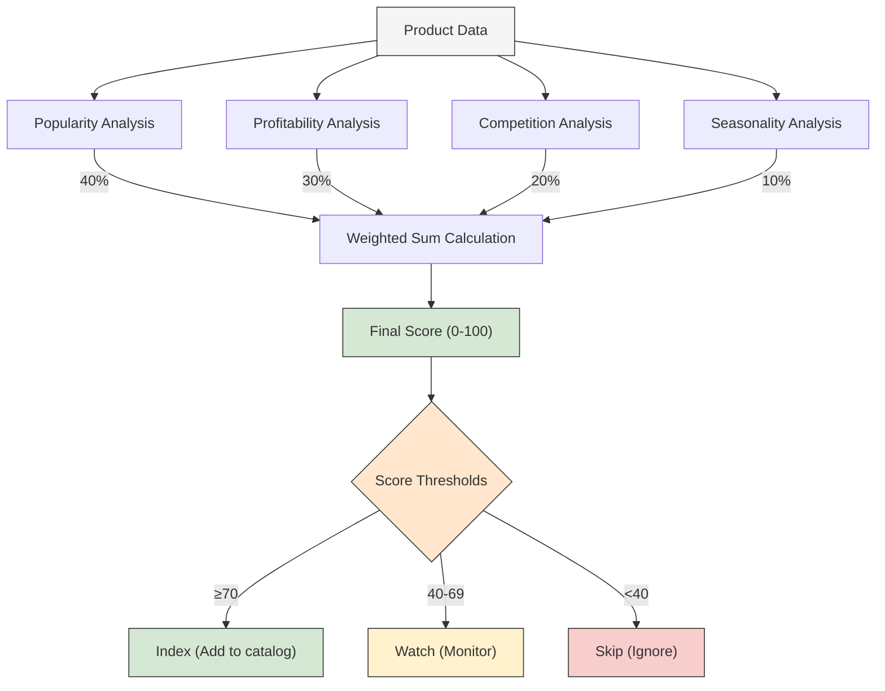
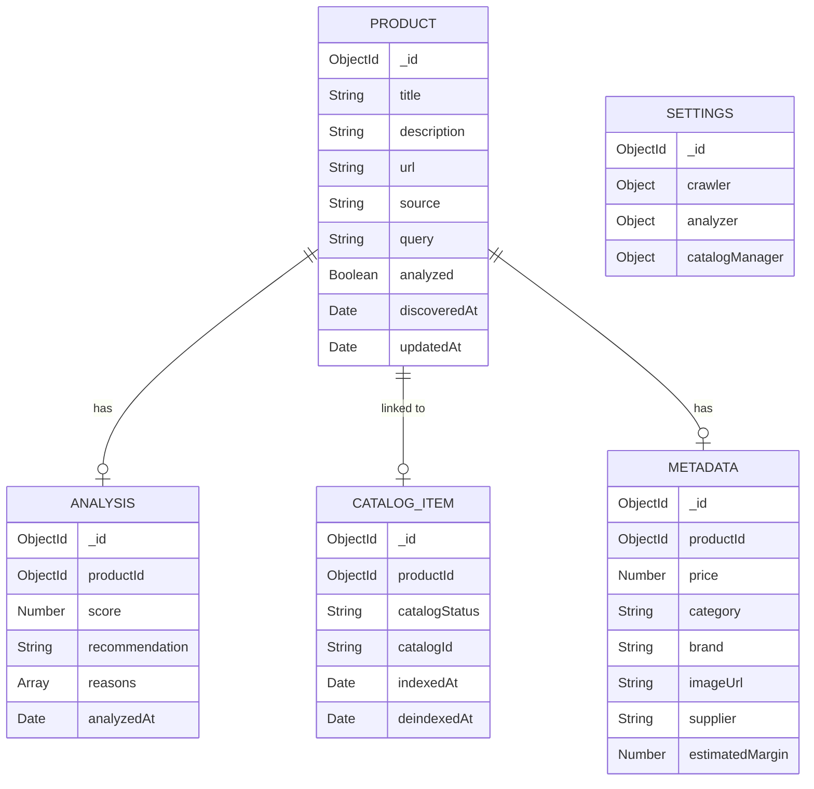
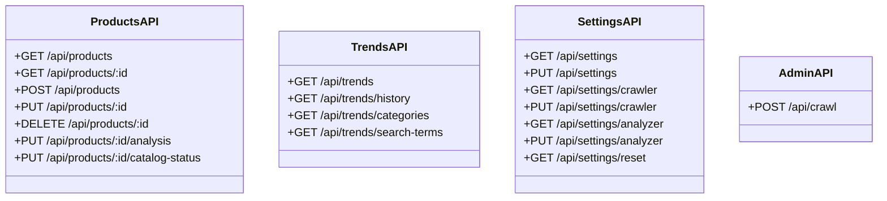
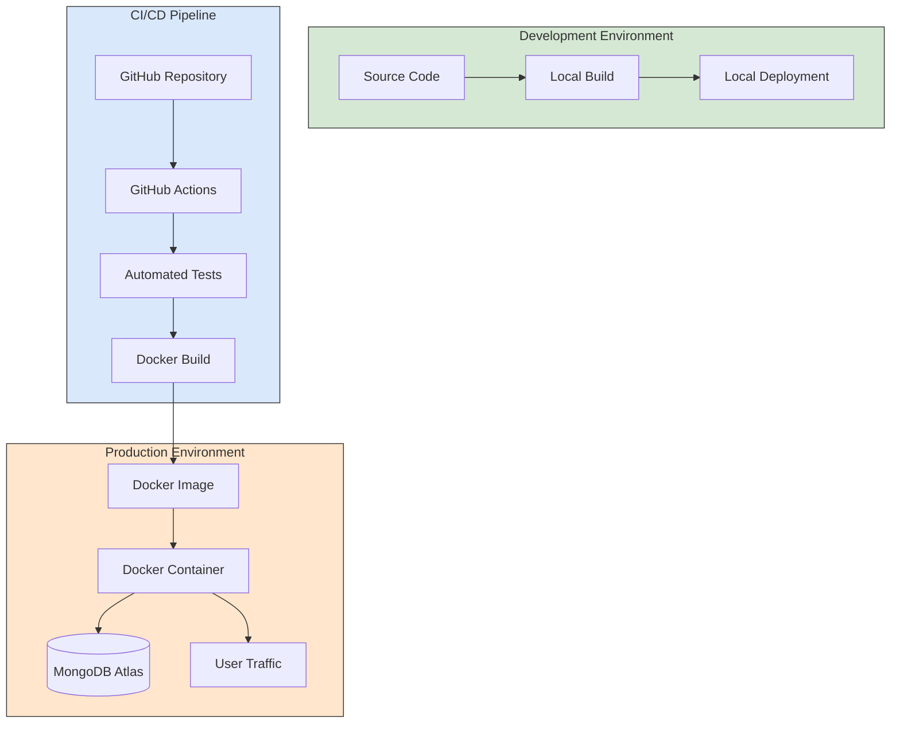
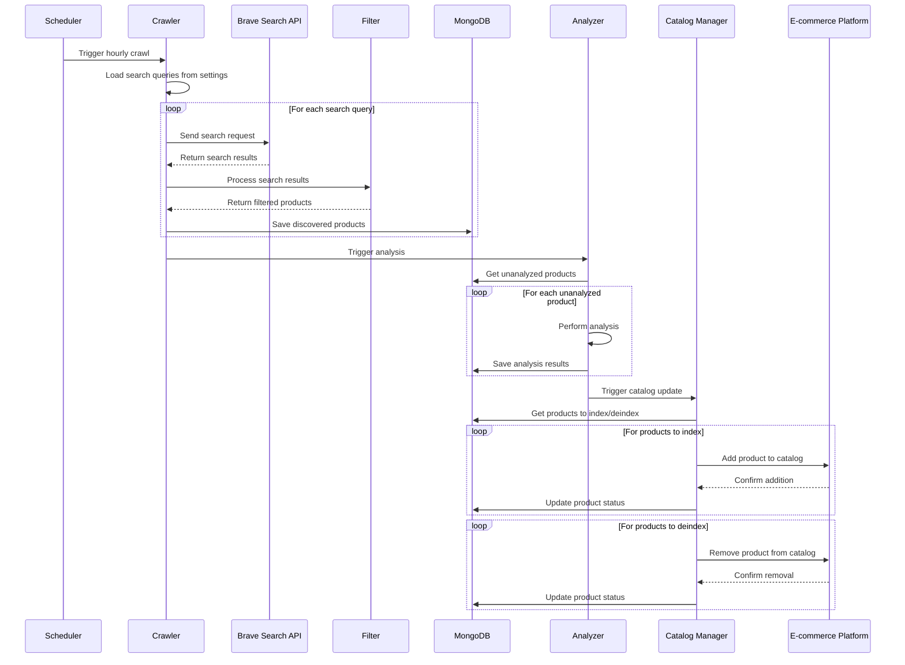
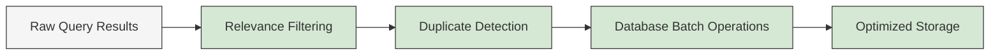
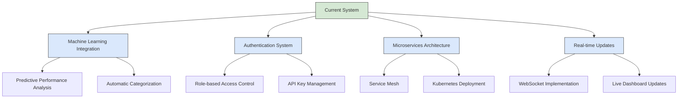

# DropShip Trend Crawler: System Architecture

## Overview

The DropShip Trend Crawler is designed with a modular, maintainable architecture that separates concerns and follows best practices in modern web application development. This document provides detailed information about the system's architecture, components, data flow, and design decisions.

## High-Level Architecture

## Core Components

### Crawler Service

The Crawler Service is responsible for discovering potential products by querying the Brave Search API.

**Key Responsibilities:**
- Execute scheduled searches with predefined queries
- Process and filter search results for relevance
- Store discovered products in the database
- Handle API rate limiting and error recovery

**Internal Structure:**

### Analyzer Service

The Analyzer Service evaluates products to determine their potential for dropshipping success.

**Key Responsibilities:**
- Analyze products based on multiple criteria
- Calculate scoring using weighted factors
- Generate recommendations (index, watch, skip)
- Update product analysis in the database

**Scoring Algorithm:**

### Catalog Manager

The Catalog Manager handles the integration with e-commerce platforms for product management.

**Key Responsibilities:**
- Add recommended products to the catalog
- Remove underperforming products from the catalog
- Track product performance metrics
- Maintain synchronization with e-commerce platforms

## Data Model

## API Structure

### RESTful Endpoints

The system exposes a comprehensive RESTful API for interacting with the application.

## Deployment Architecture

## System Operation

### Typical Crawling Process

## Technical Design Considerations

### Scalability

The system is designed to scale horizontally with increasing load:

- Stateless services allow multiple instances
- Database collections are indexed for performance
- Caching is implemented for frequently accessed data
- Asynchronous processing for long-running tasks

### Resilience

Failure handling mechanisms are built in:

- Retry logic for external API calls
- Graceful degradation to demo mode when APIs are unavailable
- Error logging and monitoring
- Transaction handling for database operations

### Security

Security considerations include:

- Environment-based configuration for sensitive credentials
- Input validation on all API endpoints
- Rate limiting for public endpoints
- CORS configuration for API access control

## Performance Optimization

## Technology Stack Details

### Backend

- **Node.js**: JavaScript runtime for server-side code
- **Express**: Web framework for RESTful API
- **Mongoose**: MongoDB object modeling tool
- **node-cron**: Task scheduler for periodic jobs
- **Axios**: HTTP client for external API calls
- **Winston**: Logging library
- **dotenv**: Environment configuration management

### Database

- **MongoDB**: NoSQL database for flexible document storage
- **Indexes**: Optimized for query performance
- **Schema validation**: Ensures data integrity

### Frontend

- **HTML5/CSS3/JavaScript**: Core web technologies
- **Chart.js**: Visualization library for analytics
- **Fetch API**: For client-side API communication

## Future Architecture Enhancements

## Conclusion

The DropShip Trend Crawler architecture is designed with modularity, scalability, and maintainability in mind. By separating concerns into distinct services and implementing clean interfaces between components, the system can evolve and grow while maintaining stability and performance. The modular design also allows for the replacement or enhancement of individual components without affecting the entire system.